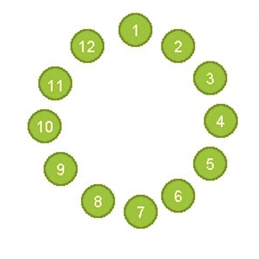

Multiple Choice Exercises
-------------------------

Answer the following **Multiple Choice** questions to
assess what you have learned in this chapter.

.. mchoice:: cds_LB_input

    What does this code do?

    ::

        void mystery(ifstream& infile) {
            Stack<string> lines;
            string line;
            while (getline(infile,line)) {
                lines.push(line);
            }
            infile.close();
            while (!lines.isEmpty()) {
                cout << lines.pop() 
                     << endl;
            }
        }

    -   Prints all lines of a file to cout

        - Wrong! Stacks are a type of container adaptors that follow LIFO(Last In First Out).

    -   Prints only the first line of a file to cout

        - Wrong! Every line != empty should be printed.

    -   Prints only the last line of a file to cout

        - Wrong! Every line != empty should be printed.

    -   Prints all lines of a file to cout in reverse

        + Correct! 

    -   All/ none/ more than one of the above

        - Wrong!

.. mchoice:: cds_LB_diffinput

    Ignoring operator precedence rules, how many distinct results are there to the following arithmetic expression : 3 * 3 + 3 * 3 ?

    -   1

        - Wrong! The computer won't follow the math rules.

    -   2

        - Could you come up with a little bit more?

    -   3

        + Correct!  (3 * 3) + (3 * 3) ; 3 * (3 + 3) * 3 ; 3 * (3 + (3 * 3))

    -   4

        - Wrong! Check out if there are the same ones for your results.

    -   More than 4.

        - Wrong! Check out if there are the same ones for your results.

.. mchoice:: cds_LB_polishnotation

    Which  infix expression does this postfix expression: 4 3 * 7 2 5 * + + equivalent to ?

    -   ((4*3) + (7*2)) + 5

        - Wrong! 

    -   (4*3) + ((7+2) + 5)

        - Wrong! 

    -   (4*3) + (7 + (2*5))

        + Correct!  

    -   Other/none/more than one

        - Wrong! 

  
.. mchoice:: cds_LB_polishnotationcont

    Contents of the stack of the last question, reading from top-down:

    -  7, 12

        - Wrong! You might miss the "*".

    -  2, 7, 12

        - Wrong! 5 seems to be the last number

    -   10, 7, 12

        + Correct!  

    -   10, 5, 2, 7, 12

        - Wrong! 5 has been operated.

.. mchoice:: cds_LB_fifo

    How many of these operate as FIFO/Queue?

    -  Patients waiting in a hospital Emergency Room

        + Correct!

    -  Passengers boarding and exiting an airplane

        - It should be last in, first out, or first in first out if you take first class into account. So actually we cannot be sure.

    -   Passengers boarding and exiting an elevator (assume all board on the ground floor and exit at the same destination)

        - It should be last in, first out.  

    -   People waiting in line for an amusement park ride

        + Correct!  

.. mchoice:: cds_LB_Josephus

    People are standing in a circle waiting to be executed. Counting begins at a specified point in the circle and proceeds around the circle in a specified direction. After a specified number of people are skipped, the next person is executed. The procedure is repeated with the remaining people, starting with the next person, going in the same direction and skipping the same number of people, until only one person remains, and is freed. 

    Where do you sit?

    -  1 or 2

        + Correct!

    -  1 or 6

        - Wrong.

    -   5 or 10

        - Wrong. 

    -   5 or 6

        - Wrong. 

